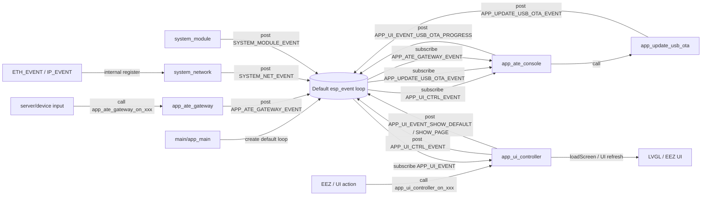

# 系统数据流

本文描述当前工程里的事件流向，重点说明：

- 谁 `post`
- 谁 `subscribe`
- 事件如何通过默认 `esp_event` 循环流动

当前代码快照基于仓库现状整理，不假设“未来应该怎么接”。

---

## 1. 总览

当前工程里当前只保留一套事件通道：

### 默认事件循环

由 `main/app_main()` 创建：

```c
esp_event_loop_create_default();
```

这一套承载当前 App/System 事件：

- `APP_UI_CTRL_EVENT`
- `APP_UI_EVENT`
- `APP_UPDATE_USB_OTA_EVENT`
- `APP_ATE_GATEWAY_EVENT`
- `SYSTEM_NET_EVENT`
- `SYSTEM_MODULE_EVENT`
- 以及一批 runtime 预留事件基

---

## 2. 当前“已经接通”的主数据流



### 这张图的实际含义

1. `main` 只负责创建默认事件循环和启动 `app_ate_console`
2. UI 命令先进入 `app_ui_controller`
3. `app_ui_controller` 不直接做业务，而是 `post APP_UI_CTRL_EVENT`
4. `app_ate_console` 订阅 `APP_UI_CTRL_EVENT`，收到后决定是否调用：
   - `app_update_usb_ota`
   - `app_ate_gateway`
   - 以及后续要补齐的其他 runtime
5. `app_update_usb_ota` 进度变化后，反向 `post APP_UPDATE_USB_OTA_EVENT`
6. `app_ate_console` 订阅到 OTA 进度后，再转成 `APP_UI_EVENT_USB_OTA_PROGRESS`
7. `app_ui_controller` 自己订阅 `APP_UI_EVENT`，最终驱动 LVGL 页面切换和进度显示

这说明当前真正闭环跑通的是：

`UI -> UI Controller -> Console -> OTA/Gateway -> Console -> UI Event -> UI Controller -> LVGL`

---

## 3. 默认事件循环中的 post / subscribe 关系表

| 事件基 | post 方 | subscribe 方 | 当前状态 | 说明 |
| --- | --- | --- | --- | --- |
| `APP_UI_CTRL_EVENT` | `app_ui_controller` | `app_ate_console` | 已接通 | UI 命令总线，承载开始测试、开始 OTA、重扫等请求 |
| `APP_UI_EVENT` | `app_ui_controller`、`app_ate_console` | `app_ui_controller` | 已接通 | UI 渲染总线，承载默认页、切页、OTA 进度 |
| `APP_UPDATE_USB_OTA_EVENT` | `app_update_usb_ota` | `app_ate_console` | 已接通 | OTA 组件内部状态对外广播 |
| `APP_ATE_GATEWAY_EVENT` | `app_ate_gateway` | `app_ate_console` | 已接通 | 网关连接状态、转发动作对外广播 |
| `SYSTEM_NET_EVENT` | `system_network` | 暂无 | 已定义，未接上层 | 网络层把 `ETH_EVENT/IP_EVENT` 翻译成业务化网络事件 |
| `SYSTEM_MODULE_EVENT` | `system_module` | 暂无 | 已定义，未接上层 | 模组在线/离线/状态/命令完成事件 |
| `APP_MODULE_RUNTIME_EVENT` | `app_module_runtime` | 暂无 | 预留 | 模组运行态快照与状态变化 |
| `APP_INSTRUMENT_RUNTIME_EVENT` | `app_instrument_runtime` | 暂无 | 预留 | 仪器运行态快照、日志、在线变化 |
| `APP_VISION_RUNTIME_EVENT` | `app_vision_runtime` | 暂无 | 预留 | 视觉状态、结果、日志 |
| `APP_UPDATE_NETWORK_OTA_EVENT` | `app_update_network_ota` | 暂无 | 预留 | 网络 OTA 进度和结果 |
| `APP_UPDATE_RUNTIME_EVENT` | `app_update_runtime` | 暂无 | 预留 | Update 聚合层事件 |
| `APP_DEVICE_PROGRAMMING_EVENT` | `app_device_programming` | 暂无 | 预留 | 烧录流程进度和结果 |
| `APP_FEEDBACK_RUNTIME_EVENT` | `app_feedback_runtime` | 暂无 | 预留 | 灯光、音频、反馈记录 |
| `APP_USB_MSC_DEVICE_EVENT` | `app_usb_msc_device` | 暂无 | 预留 | USB MSC 状态变化 |

---

## 4. 当前明确存在的 subscribe 点

### 4.1 `main`

- 创建默认事件循环
- 不直接订阅任何业务事件

### 4.2 `app_ui_controller`

订阅：

- `APP_UI_EVENT`

用途：

- 接受 UI 渲染事件
- 切换页面
- 刷新 OTA 进度显示

说明：

- `APP_UI_EVENT` 是一个“渲染控制总线”
- `app_ui_controller` 既会 `post`，也会 `subscribe`
- 这是刻意的自收敛结构，目的是把 LVGL 操作集中在 Controller 一侧

### 4.3 `app_ate_console`

订阅：

- `APP_UI_CTRL_EVENT`
- `APP_UPDATE_USB_OTA_EVENT`
- `APP_ATE_GATEWAY_EVENT`

用途：

- 接收 UI 指令
- 转发给 OTA / Gateway / 后续业务 runtime
- 再把部分业务结果转回 UI 事件

说明：

- `app_ate_console` 当前是默认事件循环里的“应用编排层”

### 4.4 `system_network`

订阅的不是你自己定义的事件基，而是 IDF 内建事件：

- `ETH_EVENT`
- `IP_EVENT`

然后 `system_network` 会转发成：

- `SYSTEM_NET_EVENT_CONNECTED`
- `SYSTEM_NET_EVENT_DISCONNECTED`
- `SYSTEM_NET_EVENT_GOT_IP`
- `SYSTEM_NET_EVENT_LOST_IP`

注意：

- `SYSTEM_NET_EVENT_READY` 在头文件里声明了
- 当前实现里还没有真正 `post`

---

## 5. 当前明确存在的 post 点

### 5.1 UI 链路

`app_ui_controller` 会 `post`：

- `APP_UI_CTRL_EVENT_START_TEST`
- `APP_UI_CTRL_EVENT_STOP_TEST`
- `APP_UI_CTRL_EVENT_MANUAL_RESCAN_INSTRUMENT`
- `APP_UI_CTRL_EVENT_MANUAL_RESCAN_MODULE`
- `APP_UI_CTRL_EVENT_CLEAR_INSTRUMENT_BINDING`
- `APP_UI_CTRL_EVENT_TRIGGER_VISION_CHECK`
- `APP_UI_CTRL_EVENT_START_USB_OTA`
- `APP_UI_CTRL_EVENT_ENABLE_USB_MSC`
- `APP_UI_CTRL_EVENT_TEST_CONFIG_CHANGED`

以及：

- `APP_UI_EVENT_SHOW_DEFAULT`
- `APP_UI_EVENT_SHOW_PAGE`

`app_ate_console` 会补充 `post`：

- `APP_UI_EVENT_USB_OTA_PROGRESS`

### 5.2 OTA 链路

`app_update_usb_ota` 会 `post`：

- `APP_UPDATE_USB_OTA_BUS_EVENT_NOTIFY`
- `APP_UPDATE_USB_OTA_BUS_EVENT_PROGRESS`
- `APP_UPDATE_USB_OTA_BUS_EVENT_RESULT`

其中 `NOTIFY` 负载里的业务事件包括：

- `APP_UPDATE_USB_OTA_EVENT_USB_INSERTED`
- `APP_UPDATE_USB_OTA_EVENT_USB_REMOVED`
- `APP_UPDATE_USB_OTA_EVENT_FILE_DETECTED`
- `APP_UPDATE_USB_OTA_EVENT_STARTED`
- `APP_UPDATE_USB_OTA_EVENT_PROGRESS_UPDATED`
- `APP_UPDATE_USB_OTA_EVENT_SUCCEEDED`
- `APP_UPDATE_USB_OTA_EVENT_FAILED`

### 5.3 Gateway 链路

`app_ate_gateway` 会 `post`：

- `APP_ATE_GATEWAY_BUS_EVENT_NOTIFY`
- `APP_ATE_GATEWAY_BUS_EVENT_DEVICE_COMMAND`
- `APP_ATE_GATEWAY_BUS_EVENT_SERVER_DATA`

其中 `NOTIFY` 负载里的业务事件包括：

- `APP_ATE_GATEWAY_EVENT_STARTED`
- `APP_ATE_GATEWAY_EVENT_CONNECTION_CHANGED`
- `APP_ATE_GATEWAY_EVENT_SERVER_COMMAND_ROUTED`
- `APP_ATE_GATEWAY_EVENT_DEVICE_DATA_FORWARDED`

### 5.4 System 链路

`system_module` 会 `post`：

- `SYSTEM_MODULE_EVENT_ONLINE`
- `SYSTEM_MODULE_EVENT_OFFLINE`
- `SYSTEM_MODULE_EVENT_STATUS_UPDATED`
- `SYSTEM_MODULE_EVENT_COMMAND_DONE`

`system_network` 会 `post`：

- `SYSTEM_NET_EVENT_CONNECTED`
- `SYSTEM_NET_EVENT_DISCONNECTED`
- `SYSTEM_NET_EVENT_GOT_IP`
- `SYSTEM_NET_EVENT_LOST_IP`

### 5.5 预留 runtime 链路

以下组件都已经具备 `post` 能力，但当前没有上层订阅者：

- `app_module_runtime`
- `app_instrument_runtime`
- `app_vision_runtime`
- `app_update_network_ota`
- `app_update_runtime`
- `app_device_programming`
- `app_feedback_runtime`
- `app_usb_msc_device`

---

## 6. 当前最值得关注的真实闭环

如果只看“现在真的接起来并形成业务闭环”的部分，核心是下面这条：

```text
UI动作
  -> app_ui_controller
  -> APP_UI_CTRL_EVENT
  -> app_ate_console
  -> app_update_usb_ota
  -> APP_UPDATE_USB_OTA_EVENT
  -> app_ate_console
  -> APP_UI_EVENT_USB_OTA_PROGRESS
  -> app_ui_controller
  -> LVGL页面刷新
```

以及另一条较短链路：

```text
外部网关输入
  -> app_ate_gateway
  -> APP_ATE_GATEWAY_EVENT
  -> app_ate_console
```

---

## 7. 结论

当前架构可以概括成一句话：

> 默认 `esp_event` 已经是 App/System 层的统一总线；真正跑通的主链路是 `UI Controller <-> Console <-> OTA/Gateway`，其余 runtime 事件基已经定义完成，但大多还没有接入上层订阅者。

如果后面继续整理，建议下一步优先补两件事：

1. 给 `SYSTEM_NET_EVENT` 和 `SYSTEM_MODULE_EVENT` 接上 App 层订阅者
2. 决定 `app_module_runtime / app_instrument_runtime / app_vision_runtime` 谁来做统一编排和聚合
